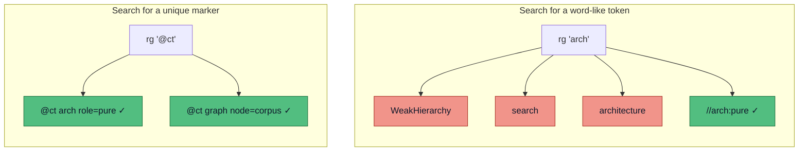
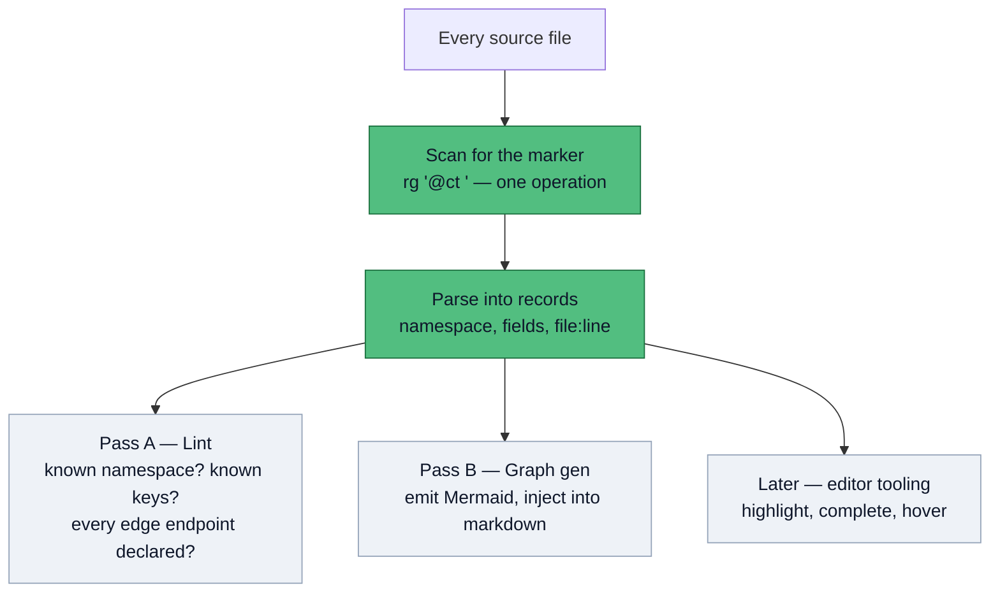

# ADR 0002: A unique marker for code tags

Status: Proposed (2026-07-05)

This Architecture Decision Record (ADR) decides **how we mark up code with machine-readable tags**, and the small set of tools that read those tags. Today one tag exists — `//arch:<role>`, which [the code map](/concept/code-map) reads to group functions by role. The plan is to grow this into a general, eventually standalone system: a linter that checks every tag is valid, a generator that draws [Mermaid](https://mermaid.js.org/) graphs from them, and later editor support (highlighting, completions). Every one of those tools rests on a single requirement, and this record is about getting that requirement right before anything is built on top of it.

## The one thing everything depends on: finding every tag

The whole system is worthless if a tool can miss a tag. The linter must check *all* of them; the graph generator must draw from *all* of them. So the first operation, before parsing or validating anything, is always the same: **scan the entire codebase and find every tag.** That scan has to return every real tag and nothing else.

:::danger The failure mode
If the search returns junk, the linter reports errors on lines that are not tags, and the graph sprouts nodes that do not exist. If the search misses a tag, a broken reference ships silently — the exact "docs that no longer match the code" failure this project exists to catch. Both come from one root cause: a marker you cannot search for cleanly.
:::

## Why `arch` fails the test

The current word — `arch` — is not identifiable. It is a common English fragment, so a plain search for it drowns the real tags in noise. Measured in this repo today:

| What you search for | Real tags found | False positives |
|---|---|---|
| `arch` (the bare word) | 15 | `WeakHierarchy`, `hierarchy`, `search`, `architecture`, prose … |
| `//arch:` (the full prefix) | 15 | 0, but the string still *contains* `arch`, so any looser search reels the noise back in |

The point is not that `//arch:` is unsearchable — it is that the token is built from an ordinary word, so it is fragile. The moment someone greps for `arch` (the obvious thing to try), or a tool does a case-insensitive or fuzzy match, the noise floods back. A good marker should be impossible to confuse with prose *even by accident*.



The left query returns four hits, three of them garbage. The right query returns only tags. That gap *is* the decision.

## Decision: a unique sigil plus a namespace

Adopt a marker with four required properties. Any token that has all four works; the exact glyph is cosmetic and can be renamed.

| Property | Why it matters |
|---|---|
| **Rare** — never occurs in normal prose or code | a search returns tags and only tags, with zero false positives |
| **Not model-emitted** — a code model will not produce it by chance | every occurrence is *intentional*, never hallucinated boilerplate |
| **Comment-leader agnostic** — sits after `//`, `#`, `--`, `<!--` alike | the same scanner works across languages when this leaves this project |
| **Structured** — `marker · namespace · payload` | one marker serves every future tag kind, instead of burning a new word each time |

The proposed form (rename freely):

```go
//ct arch  role=pure                 // the existing arch tag, generalized
//ct graph node=corpus role=io       // a node in a generated graph
//ct graph edge=corpus->finding      // an edge between two nodes
```

`@ct` ("code tag") is the unique sigil — the thing you search for. `arch` and `graph` are **namespaces**: which pass cares about this tag. Everything after is the payload. So the universal search is `rg '@ct '` (returns *every* tag in the repo), and a per-pass search is `rg '@ct graph'` (just the graph tags). Prior art for the convention: Go's own `//go:generate` / `//go:build` directives, and the rejected-but-well-designed [PEP 350 codetags](https://peps.python.org/pep-0350/).

## What reads the tags: one scan, many passes

The marker is deliberately dumb. All the intelligence lives in passes that share a single scan-and-parse front end, so no tool re-implements "find the tags":



Build order is left to right. **Pass A (lint)** is the first slice and the highest value: wire it into `just check` so a typo'd tag or a dangling edge fails CI. **Pass B (graph)** emits Mermaid into a managed block a generator can overwrite in place — the same "generated, never hand-copied" rule the [corpus page](/spec/corpus) already follows.

## Open question: where do graph edges come from?

:::warning Still undecided: derived vs hand-tagged edges
A grouping tag (`role=pure`) is safe — it describes one symbol in place. A graph *edge* names a relationship between two symbols, and that is where drift starts. Two options:

- **Hand-tagged** (`@ct graph edge=a->b`) — flexible, works in any language, expresses logical links the compiler cannot see. But the comment rots the moment the code's real dependency changes and the tag does not.
- **Derived from the code** — for Go we already walk the AST in [`codemap`](/concept/code-map); real import and call edges come for free and cannot drift, because the graph *is* the code.

Leaning toward derived-first, with hand-tags only for logical edges the code cannot express — the same reason [golden files](/decisions/0001-test-and-corpus-strategy) beat hand-written expectations. This choice sets what Pass A's lint must check (endpoint resolution) and how Pass B builds the graph, so it is the next thing to settle.
:::

## Consequences

One universal search (`rg '@ct '`) reliably returns every tag in the codebase, forever — which is the property the whole system was blocked on. A unique, namespaced marker also means the system scales to new tag kinds without new glyphs, and lifts cleanly out of this project later since the core carries no reviewer-specific assumptions.

The cost is a one-time migration: the existing `//arch:<role>` tags (15 of them today) must be rewritten to the new form, and `codemap`'s parser (`tagOf`) updated to read it. Small and mechanical, but it must happen in one pass so nothing is left on the old syntax. Until the linter exists, the tags remain hand-maintained, so the migration should land alongside Pass A rather than before it.
