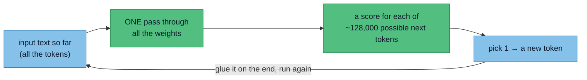
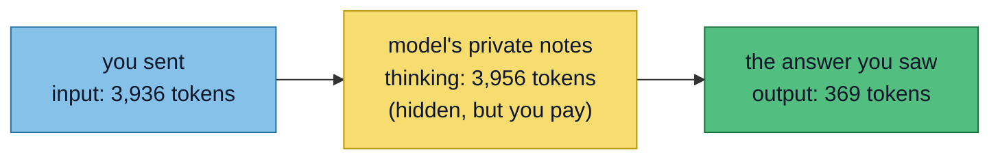
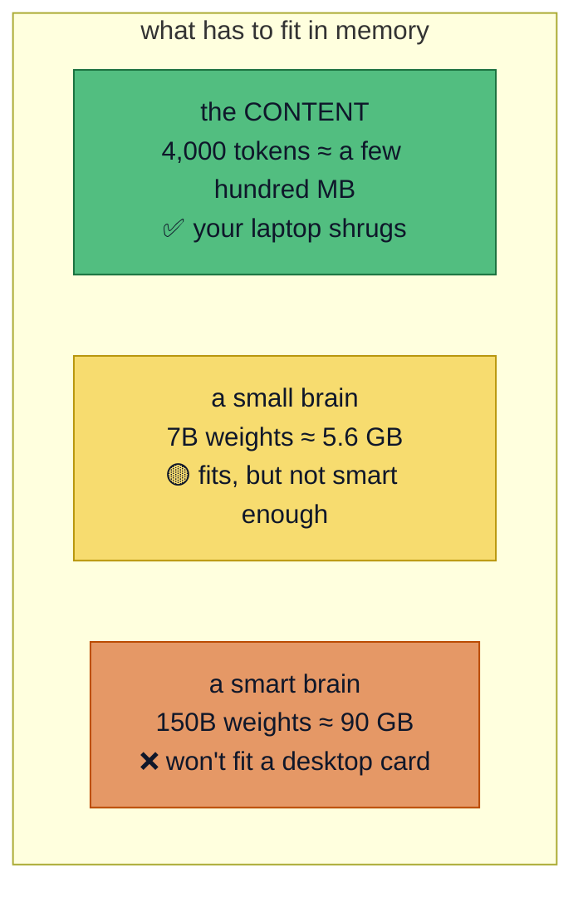
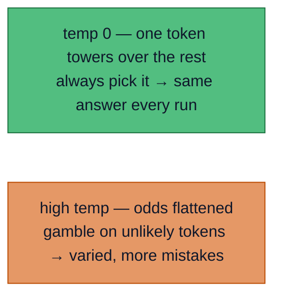
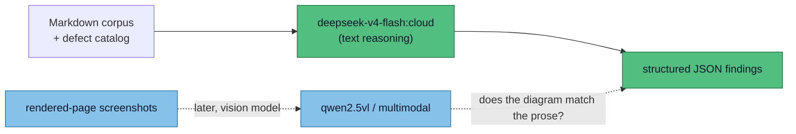
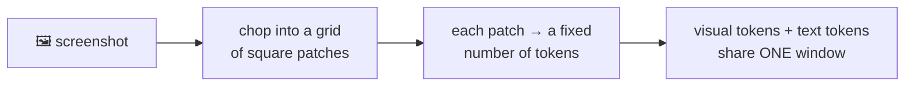
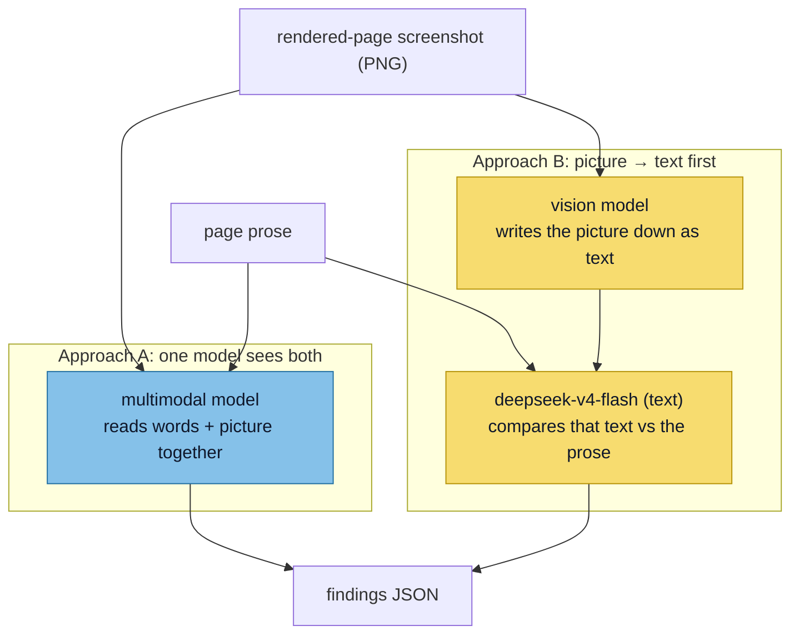
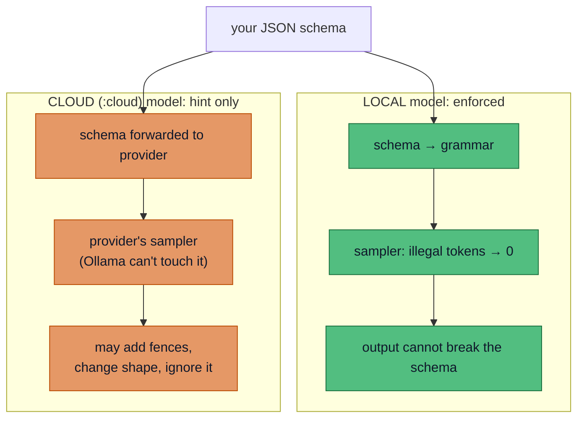

# ADR 0003: Which model runs the LLM-judgment layer

Status: Accepted (2026-07-16) · **Updated 2026-07-19** with local `gpt-oss:20b` (rejected) · **Updated 2026-07-23** with local `qwen3:30b-a3b` and `qwen2.5vl:7b` trials · **Updated 2026-07-25** with local-results recap + GPU-upgrade comparison

This Architecture Decision Record (ADR) picks the **model** for the one job in the reviewer that needs judgment rather than a provable answer: the Large Language Model (LLM) that reads a page and gives an opinion.

## Models at a glance

Every model referenced below, in one place — modality, where it runs, and (for local models) size and where it fits. VRAM is at Ollama's default Q4, roughly `0.6 GB × billions-of-params` plus context.

| Model | Text | Image | Loc | Params | VRAM (Q4) | Fits on |
|---|:-:|:-:|:-:|---|---|---|
| `gemini-3.6-flash` | ✓ | ✓ | cloud | — | — | cloud |
| `deepseek-v4-flash` | ✓ | ✗ | cloud | 158B MoE | — | cloud |
| `minimax-m3` | ✓ | ✓ | cloud | 150–600B | — | cloud only |
| `qwen3:30b-a3b` | ✓ | ✗ | local | 30B · 3B active | ~18 GB | 12 GB + offload |
| `qwen2.5vl:3b` | ✓ | ✓ | local | 3.8B | ~4 GB | any GPU |
| `qwen2.5vl:7b` | ✓ | ✓ | local | 7B | ~6 GB | 12 GB, resident |
| `gpt-oss:20b` | ✓ | ✗ | local | 21B MoE | ~13–16 GB | 16 GB+ (12 w/ offload) |
| `gpt-oss:120b` | ✓ | ✗ | local | 117B MoE | ~63 GB | 128 GB box / 64 GB + offload |
| `llama3.2-vision:11b` | ✓ | ✓ | local | 11B | ~9–10 GB | 12 GB+ |
| `qwen3.5` (27–35B) | ✓ | ✓ | either | 27–122B | ~18–22 GB | 24 GB |


## Primer: how these models actually work

New to LLMs? Read this first — the rest of the ADR leans on it. Five ideas, and the last one is the one that decides what hardware you need.

### Tokens: the only currency

A **token** is a chunk of text, roughly ¾ of a word (`running` might split into `run` + `ning`). Everything is tokens:

- what you send in → **input tokens**
- what the model writes back → **output tokens**
- an image gets chopped into tokens too (a small picture ≈ a few hundred)

So your instinct is right: words in ≈ tokens in, answer out ≈ tokens out. That is the whole meter.

### One token = one trip through the model

The model is a fixed stack of weights (nodes and numbers). Here is how text comes out of it:



To write **one** token, the input runs through the whole stack **once**. Out comes a score for every possible next token; pick one. To write the next token, the model glues the one it just wrote onto the end of the input and runs the stack **again**. Write 400 tokens = 400 passes.

:::tip This answers your "how many times through the weights?"
Once per output token — not a dial you set. Generating is slow *because* it is strictly one token at a time: each token waits for the one before it.
:::

### "Thinking" is just the model writing notes to itself

"Thinking", "reasoning", "chain-of-thought" — same thing, and it is not magic. The model writes its working-out **as tokens**, then reads its own working-out to write the final answer. Since every token it generates is glued back onto the input (above), those notes become part of what it sees.

You guessed it exactly: **yes, it is recursive — output becomes input, over and over.**



Your Gemini call proves it:

> input **3,936** · thinking **3,956** · answer **369** · total **8,261**

The model wrote ~4,000 tokens of private notes to produce a 369-token answer. You paid for notes you never saw.

And those notes are *why* it caught the buried contradiction the small local models missed.

A **thinking model** (DeepSeek-R1, Qwen3-thinking, the Gemini and OpenAI "thinking" modes) is trained to always write notes first: slower and pricier, but far better on hard problems. A non-thinking model blurts the answer in one shot — fast, weaker on anything subtle.

:::note "If it researches for 10 hours, what's counted?"
Still just tokens. Two shapes: **thinking** is one long generation (more output tokens); **agentic research** is many separate calls, where each answer and each web result feeds the next call's input. Either way, total tokens = everything that passed through, and wall-clock = tokens ÷ speed.
:::

### Size is not smarts — the bit that decides your hardware

This is your real question.

**Tokens measure how *much*, never how *well*.** Two models both happily accept 10 tokens — but the *quality* of the answer comes from the model's brain, not the token count.

What makes the brain: the **number of parameters** (weights) and the quality of training. A 3-billion and a 150-billion model read the same 10 tokens; the big one just gets it.

There is no single "intelligence number" — that is what benchmarks, and your corpus, exist to measure: *did it actually catch the bug?*

Here is the punchline for running locally:



- **The content is featherweight.** Holding 4,000 tokens costs a few hundred MB. Your PC can *easily* fit the text.
- **The brain is the anvil.** The weights are what must fit: ~5.6 GB for a 7B model, ~90 GB for a 150B one.

That one line is the whole local-model story: **you were never short on room for the content — you are short on room for the intelligence.**

### Temperature: the boldness dial

Nothing to do with passes through the weights. At each step the model has odds for every possible next token. **Temperature** sets how boldly it picks:



For a checker like this reviewer you want **low temperature**: the same careful answer every run, not creativity.

---

## The decision

Use **`deepseek-v4-flash:cloud`** for the text review pass.

The task is text reasoning: read a set of Markdown pages, compare them to a catalog of defect categories, emit structured JSON.

On that axis `deepseek-v4-flash` is the strongest of the three — a 158B-parameter mixture-of-experts model with a 1M-token window and native structured output, versus a 3.8B local model.

It replaced the retired Gemini flash with a one-line model-string change.

:::note What we gave up
`deepseek-v4-flash` **cannot see images**. That is fine — correct, even — for the text pass. Whether a *diagram's content* matches the prose is a separate, later job for a vision model. Whether an image *rendered and is legible* is not a model's job at all; it belongs to the screenshotter. See the scope boundary in [the approach](/concept/approach).
:::



## How images cost tokens

A model does not read pixels. An image is turned into **tokens** first — the same currency as text — so it spends from the same budget as words:



Cost per image, by model:

- **Gemini-style (tiled):** small images (≤384px) cost a flat ~258 tokens; larger ones are cut into 768×768 tiles at ~258 tokens each. A big screenshot ≈ 1,000–1,500 tokens.
- **Qwen2.5-VL (dynamic):** more pixels → more patches → more tokens. A full-page screenshot ≈ 1,000–2,000 tokens.

Rule of thumb: **an image is expensive words.** One full-page screenshot ≈ the token cost of 750–1,500 words. And a text-only model has *no* vision encoder, so an image is simply invisible to it — that is why `deepseek` (text-only) needs a separate vision model for the visual pass.

:::info Why a text model can't just be handed the image's tokens
A visual token is **not** a caption or a description. It is a vector of numbers the vision encoder produces, in a space specific to *that* model. A text-only model has no encoder to make them and was never trained to read them. The only bridge to a text model is real text: a vision model must first write the image down as words. See Approach B below.
:::

## How many pages realistically fit

Rules of thumb:

- 1 word ≈ 1.4 tokens in Markdown (prose ~1.3; the rest covers `#`, `|`, `[]()`).
- 1 "page" ≈ 500 words ≈ ~700 tokens.
- 1 full-page screenshot ≈ ~1,500 tokens.
- Usable input < window: leave room for the prompt, the catalog, and the model's *output*.

| Model | Usable input | Text-only pages | Pages + one screenshot each |
|---|---|---|---|
| `deepseek-v4-flash:cloud` | ~980,000 | **~1,400** | n/a (no images) |
| `qwen2.5vl:3b` | ~112,000 | ~160 | ~50 |
| `gemini-3-flash-preview` | ~980,000 | ~1,400 | ~440 |

:::tip The window is not the bottleneck
Our whole corpus is a handful of small files — a few thousand tokens. Every one of these models swallows the entire site many times over. So context size should not drive the choice. The real limits, in order: (1) does it support images at all; (2) the output budget when many defects are reported; (3) reasoning quality decaying over long inputs ("lost in the middle"), long before the window fills. **Pick for reasoning and image support, not the biggest context number.**
:::

## The visual pass: two ways to wire it

The visual job is narrow (see [the approach](/concept/approach)): **does a diagram's *content* contradict the words on the page?** Not whether it rendered or is legible — that is the screenshotter's. A text-only model can't see pixels, so there are exactly two wirings.



**Approach A — one model sees both.** A single model reads the words and the picture together and judges them in one go.

Most accurate: nothing is lost turning the picture into words.

> **Example:** it sees the route diagram says "8 hours" *and* the spec says "30 minutes" in one pass — no step in between to turn the image into words.

:::note Downside
Harder to tell what it actually "saw" in the image and how it read it — you can't easily save-and-test that.
:::

**Approach B — turn the picture into text first.** A vision model writes the picture down as plain text — a **transcription**, i.e. a flat list of what is in the image, like `airport → 6 hours → hotel`.

Then our normal text model compares that text to the spec.

It loses anything the vision model didn't write down. But the transcription is **a file you can save and test** — the thing this project values.

> **Catch:** prompt for a structured list, not a chatty caption. A caption ("a route map to the hotel") paraphrases away the exact "6 hours" the whole check depends on.

:::tip Worked example
Vision model is told: *list every label, number, place name and arrow*. It outputs the label verbatim: `airport → 6 hours → hotel`.
Spec says: `drive must be under 2 hours`.
Text model compares → 6 h > 2 h → **flag it**.
A free-form caption ("shows the driving route") would have dropped the "6 hours" and the check would pass silently.
:::

:::tip Recommendation
Start with **Approach B**: the transcription is testable and it keeps the text model we already trust. Fall back to **Approach A** only if the transcription keeps missing real contradictions.
:::

:::note Why not just switch everything to `minimax-m3`?
Tempting — one 1M-token multimodal model would collapse both passes into one. But the text pass works today on `deepseek-v4-flash`. Swapping a working, tested component for a bigger unvalidated one is a change to make *deliberately*, with the corpus as evidence, not by default.
:::

## Structured output: enforced locally, a hint in the cloud

The single most important operational finding. `minimax-m3:cloud` ignored the JSON schema we passed, wrapped its answer in a ```` ```json ```` fence, and changed the shape. **Not a minimax bug** — it is how Ollama works:

> "Ollama's Cloud currently does not support structured outputs." ([Ollama docs](https://docs.ollama.com/capabilities/structured-outputs))

Enforcement happens at the **sampler** — the primer's step that picks each token.

Ollama only controls that sampler for **local** models. There, it compiles your schema into a grammar and forces any token that would break the schema to zero probability. Malformed output is *mechanically impossible*.

On the **cloud** path Ollama is just a proxy; it can't touch the remote sampler. So the schema degrades to a polite suggestion.



Consequences:

- **No `:cloud` model enforces the schema** — not minimax, not deepseek. It is the cloud path, not the model.
- **The local guarantee only fires if the schema is in a shape Ollama can read — and ours was not.** `invopop/jsonschema.Reflect` emits a top-level `$ref` into a `$defs` block. Ollama's converter can't follow that indirection, silently stops constraining, and the model only loosely copies the shape from the prompt. That — not the model — is why the first `gpt-oss` run returned bare strings. Fix is on our side: emit a flat, inline schema (see operational notes). Model-independent.
- **A 100% guarantee means going provider-native, not through Ollama:** [OpenAI Structured Outputs](https://developers.openai.com/api/docs/guides/structured-outputs) (`strict: true`), Google Gemini `responseSchema`, or self-hosted [vLLM](https://docs.vllm.ai/en/latest/features/structured_outputs/) with XGrammar.

This points to **Approach B with the structured stage run locally**: only the final findings JSON needs the guarantee, and a local grammar-constrained model gives it for free. The cloud vision model just emits plain text, where no schema is needed.

:::info Sources
Enforcement + cloud limit: [Ollama docs](https://docs.ollama.com/capabilities/structured-outputs), [blog](https://ollama.com/blog/structured-outputs). Grammar-constrained decoding: [llama.cpp GBNF](https://github.com/ggml-org/llama.cpp/blob/master/grammars/README.md). Provider guarantees: [OpenAI](https://developers.openai.com/api/docs/guides/structured-outputs), [vLLM](https://docs.vllm.ai/en/latest/features/structured_outputs/).
:::

### Two grammar engines: GBNF vs XGrammar

Moving off Ollama really means moving to a different grammar engine, so they are worth a glance.

**Both compile your schema into rules ("only these tokens are legal here") and enforce them at the sampler — so both give the same hard guarantee.** Neither produces "more valid" JSON. They differ only in *speed* and how well they handle huge, deeply-nested schemas.

| | **GBNF** (llama.cpp / Ollama) | **XGrammar** (vLLM / SGLang / …) |
|---|---|---|
| Guarantee | Hard, sampler-level | Hard, sampler-level |
| How the token mask is built | Every step, walking most of the ~128K vocab | Mostly precomputed + cached; tiny live check |
| Added latency | Noticeable on complex grammars | Near-zero (overlapped with the GPU) |
| Large / nested schemas | Works, rough edges | Handles better |
| Where you get it | Ollama, `llama-server` | vLLM, SGLang, MLC-LLM, TensorRT-LLM |

:::note Why this matters for us, honestly
1. **Not a correctness tiebreaker.** Same guarantee both ways. Our malformed JSON was neither the engine nor the model — it was the `$ref` schema we sent (above).
2. **The speed gap is real but irrelevant here.** We run a batch pass over a few small files. A run is minutes either way; per-token latency only bites at interactive or high-throughput scale.
3. **It explains why heavier engines attract if we outgrow Ollama.** XGrammar is why vLLM/SGLang leave strict output on by default with no latency tax — the fast engine comes bundled with the move.

One caveat for a *reasoning* model: you usually want the schema enforced only on the *final* answer, not the thinking notes (see primer). That scoping is a layer above the grammar; vLLM and SGLang do it explicitly, a bare `format` param does not. **This bit us on 2026-07-23:** `qwen3:30b-a3b` (a thinking model) emitted **0 reasoning tokens** because the `format` grammar forced valid JSON from the very first token — it never got to think, and missed the judgment findings. The fix is a `reasoning` scratchpad field as the first property in the schema, so working-out is allowed *inside* the valid JSON.
:::

:::info Sources
[XGrammar repo](https://github.com/mlc-ai/xgrammar) and [launch blog](https://blog.mlc.ai/2024/11/22/achieving-efficient-flexible-portable-structured-generation-with-xgrammar); paper [arXiv:2411.15100](https://arxiv.org/abs/2411.15100). GBNF: [llama.cpp grammars](https://github.com/ggml-org/llama.cpp/blob/master/grammars/README.md).
:::

## Operational notes for Ollama

Smaller lessons from wiring this up, recorded so they aren't rediscovered painfully:

- **Cloud models are a passthrough and can be retired under you.** `gemini-3-flash-preview` returned `410 Gone` mid-development when Google retired it — the library page still listed it, but the backend was gone. Cloud tags are not durable.
- **Cloud models need the explicit `:cloud` tag.** Bare `deepseek-v4-flash` fails to resolve.
- **Token counts come back on the response.** `api.ChatResponse` carries `Metrics`: `PromptEvalCount` (input) and `EvalCount` (output), set on the final `Done` message. Cloud omits the fine-grained durations, so a manual `input/output/total` log line is more useful than `Metrics.Summary()`.
- **Images attach to a message with no id.** `Message.Images` is a list of raw byte blobs — no filename. To tie an image to a page, send **one image per message** with the id in that message's text. Don't batch many images into one message and hope the model matches them up.
- **Cap the output with `num_predict`, or a weak model will run away.** The grammar makes the JSON *valid*, not *finite*. On 2026-07-23 `qwen2.5vl:7b` looped for **40 minutes / 31,813 tokens** on a ~400-token job. Set `Options: {"num_predict": 2048}` so a bad run truncates in seconds.
- **Gate image-sending on the model's actual capability, not a manual flag.** `client.Show()` returns `resp.Capabilities`; check for `"vision"` before attaching images. A text-only model (e.g. `qwen3:30b-a3b`) can't use them — deriving this from the model means it can't drift out of sync with the model string.
- **`invopop/jsonschema` emits `$ref`/`$defs`; Ollama needs the schema inline.** This is the bug behind the first `gpt-oss` run's bare strings. Force a flat, inline schema:
  ```go
  reflector := &jsonschema.Reflector{
      DoNotReference: true, // inline every definition, no $defs block
      ExpandedStruct: true, // root is the struct itself, no top-level $ref
  }
  schema := reflector.Reflect(&sampleResponse)
  ```
  `DoNotReference` drops the `$defs` map; `ExpandedStruct` drops the top-level `$ref` wrapper, so the root is `{"type":"object","properties":{…}}` directly — the shape [Ollama's docs example](https://docs.ollama.com/capabilities/structured-outputs) uses. Verified 2026-07-19.

## Model Results

Enforcement, cost, and privacy all argue for a local model on the structured stage. So: what can the boxes actually run? Confirmed via `nvidia-smi` on 2026-07-16:

| Box | GPU | VRAM (free) | RAM | Ollama |
|---|---|---|---|---|
| **desktop-work** | RTX 3060 (Ampere) | 12 GB (~10 free) | 62 GB | v0.24.0, tested 2026-07-19 |
| **degen-bot** | RTX 4050 Laptop | 6 GB (~5.6 free) | 15 GB | not installed |

**desktop-work is the only viable box.** Its 12 GB card clears the "runs a real reasoner" line; 62 GB of RAM gives CPU-offload headroom. **degen-bot's 6 GB card only holds `qwen2.5vl:3b`-sized models — the tier that already caught nothing.** Don't pursue local reasoning there.

VRAM is the binding constraint — per-model sizes and where each fits are in the [master table](#models-at-a-glance). Here is what actually happened when we ran them against the corpus:

| Model | Harness | vs the bar |
|---|---|---|
| `gemini-3.6-flash` | litellm | ✓ **Works** — caught everything, incl. the visual date mismatch. This is the bar. |
| `minimax-m3:cloud` | ollama | Findings good, but ignored the schema (cloud = no enforcement). |
| `qwen2.5vl:3b` | ollama | Below bar — `success:true` on every page, caught nothing. |
| `gpt-oss:20b` | ollama | Rejected — caught almost nothing; text-only. |
| `qwen3:30b-a3b` | ollama | Clears plumbing, misses judgment — got acronyms, missed the contradiction (thinking gagged by the grammar). |
| `qwen2.5vl:7b` | ollama | Rejected — 40 min / 31,813-token runaway; too weak, looped. |

On desktop-work specifically, a **fully-resident** model is the viable path. `qwen2.5vl:7b` (~6 GB) leaves headroom and runs fast.

A 32B *dense* model (~19–20 GB Q4) does **not** fit 12 GB — it spills ~8 GB to RAM, and because it is dense (every parameter active on every token, unlike `gpt-oss`'s MoE) that offload is brutally slow.

Dense models up to ~14B (Q4, ~9 GB) are the ceiling for this box.

Speed is measure-don't-guess: a resident 7–14B model should manage ~25–40 tok/s. Measured 2026-07-19: `gpt-oss:20b` at the 33%/67% split ran ~12.5 tok/s (~2m15s per run). Fine for a batch CI tool regardless — a full run is minutes, not interactive.

:::tip Recommendation (updated 2026-07-19)
The `gpt-oss:20b` trial settled three things:

- **The malformed JSON was our bug, not the model's.** Fix it first with the flat, inline schema (`Reflector{DoNotReference: true, ExpandedStruct: true}`). Makes JSON valid on *any* local model.
- **`gpt-oss:20b` still fails on merit** — too weak to reason at this size, and blind to images.
- **No single model on a 12 GB card will match minimax-class judgment.** The gradient says so: 3.8B nothing, 20B nothing, 150B everything.

Order of operations:

1. **Fix the schema** (top priority, correct JSON). Model-independent, lands the guarantee immediately.
2. **Try `qwen2.5vl:7b`** on desktop-work — fits fully in 12 GB, honours the inline schema, sees images. Measure whether its findings clear the bar. Expect better than 3.8B, likely short of minimax on subtle contradictions.
3. **If 7B is too weak, split the work (Approach B):** a cloud model (`minimax-m3` / `deepseek-v4-flash`) for the *reasoning*, and a small local grammar-constrained model (`qwen2.5vl:3b` is plenty) as the final stage that re-emits schema-valid JSON. The only design that gets minimax-quality findings **and** a hard JSON guarantee, each from where it is available.

Do not pursue `gpt-oss:20b` further. Do not attempt local reasoning on **degen-bot** — 6 GB cannot hold a model that reasons.
:::

## Local-only: results so far, and the GPU-upgrade question

**Bottom line first:** every local model we've run on the 12 GB RTX 3060 has missed the judgment findings the cloud 150B models catch. A bigger card (24 GB or 32 GB) lets us run *larger* models resident and fast, but the tier it unlocks — dense 30–34B — is the same tier that already fell short. So a GPU upgrade buys **speed and the ability to properly test the 30B tier**, not a guaranteed pass. Read this before spending.

Local models against the corpus, with what each needs to run *fully resident* (no slow RAM offload). VRAM at Q4 ≈ `0.6 GB × B-params` + context.

| Model | Size | Fits 3060 (12 GB)? | Min GPU to run resident | Result vs the bar |
|---|---|:-:|---|---|
| `qwen2.5vl:3b` | 3.8B | ✓ | any 6 GB+ | Caught **nothing** — `success:true` on every page |
| `qwen2.5vl:7b` | 7B | ✓ resident | 8 GB+ | Rejected — 40 min / 31.8K-token runaway, too weak |
| `gpt-oss:20b` | 21B MoE | ✗ (spills to RAM) | 16 GB | Rejected — caught almost nothing, text-only |
| `qwen3:30b-a3b` | 30B · 3B active | ✗ (spills to RAM) | 24 GB | Plumbing OK, **missed the contradiction** |
| `qwen3.5` dense | ~32B | ✗ | 24 GB | **Untested** — needs a bigger card to even try |
| `llama3.3`-class dense | ~70B | ✗ | 48 GB | Untested — out of reach of one consumer card |
| `minimax-m3` / `deepseek-v4-flash` | 150B+ | ✗ | **cloud only** (~90 GB) | ✓ **The bar** — caught everything |

### What each upgrade actually unlocks

| GPU | VRAM | Largest dense model resident (Q4) | What it unlocks for us | Verdict for this workload |
|---|---|---|---|---|
| RTX 3060 *(now)* | 12 GB | ~14B (~9 GB) | 7B resident; 20–30B only with brutal offload | Nothing tested here clears the bar |
| **RTX 3090** | 24 GB | ~32–34B (~20 GB) | `qwen3:30b-a3b` **and** a 32B dense model resident and fast | Value pick — lets us *test* the 30B tier at speed. Quality still unproven |
| **RTX 5090** | 32 GB | ~34B + more context | Same model tier as the 3090, just more headroom/longer context | Marginal over a 3090 *for this job* — the extra 8 GB doesn't reach the next model tier |
| 2×24 GB / 48 GB card | 48 GB | ~70B (~42 GB) | The 70B tier — first size that *might* approach minimax-class | The only local path that could plausibly hit the bar, and it's a gamble at real cost |

:::warning The gradient is the honest guide, not the spec sheet
Measured results go **3.8B → nothing, 20B → nothing, 30B → nothing, 150B → everything**. A 24 GB or 32 GB card lands you squarely in the 30–34B tier — the tier `qwen3:30b-a3b` already sat in when it *missed the contradiction*. The first tier with a real chance is ~70B, which needs ~48 GB (two cards or a workstation GPU), and even that is unproven against our corpus.

So: **don't buy a GPU expecting it to close the quality gap.** [Approach B](#the-visual-pass-two-ways-to-wire-it) — cloud model for the reasoning, a tiny local grammar-constrained model for the schema-valid JSON — already gets minimax-quality findings *and* the hard JSON guarantee, for free, today.
:::

:::tip If you buy one anyway
Buy for **speed and to unblock testing the 30B tier**, or because **local-only privacy is a hard requirement** — not to match the cloud. On that basis the **RTX 3090 (24 GB)** is the pick: it runs the whole 30–34B tier resident and is far cheaper than a 5090. The 5090's extra 8 GB doesn't reach the next model size for this batch job, so its premium buys little here. Whichever you get, prove it against the corpus before trusting it — measure, don't guess.
:::
