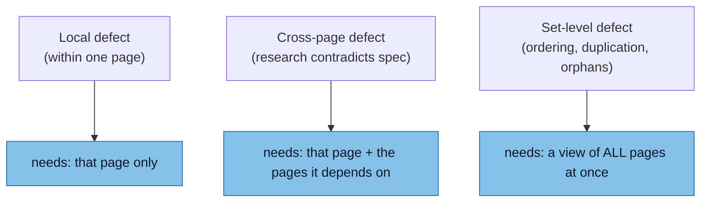
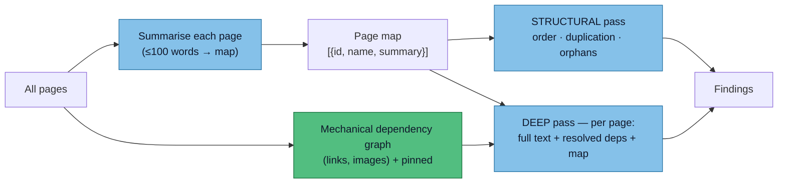

# ADR 0004: Slicing the corpus into LLM calls

Status: Proposed (2026-07-18)

This Architecture Decision Record (ADR) decides **how the corpus is divided across LLM calls** — concretely, *what context each call is allowed to see*. It sits downstream of [ADR 0003](/appendix/decisions/0003-model-comparison), which covers the model and its context window, and upstream of nothing yet: today the whole corpus goes into one call, and this record is about whether and how that should change as the site grows.

## The tension

The reviewer has to catch three *kinds* of defect, and they need different amounts of context:

A call that sees only one page in isolation cannot catch the cross-page and set-level defects. A call that sees *everything* catches them all — but does not scale. Everything below is about resolving that.

## Option 1 — one call, the whole corpus (current)

Dump every page into a single call, as `inspect` does today.

- **Pros:** every cross-reference is trivially present, so nothing is missed by construction; simplest possible design; a single request and a single output.
- **Cons at scale:** the context window is a hard ceiling, but **attention degradation bites first** — a model reasons worse over a very long input long before the window is physically full (the "lost in the middle" effect from [ADR 0003](/appendix/decisions/0003-model-comparison)). Also: no parallelism, no per-page caching or incremental re-runs, one large output that pushes against the output-token cap, and weak per-page attribution.

:::note This is correct right now
The whole corpus is ~4K tokens (measured). It fits many times over and attention is not stressed. **Option 1 is the right choice today** — this ADR is about the growth path, not a problem we currently have. Do not add machinery before the corpus needs it.
:::

## Option 2 — per-page calls with a dependency set

Review each page in its own call, giving it only the pages it *depends on*. The open question is how to build that dependency set. Three sources, in increasing power and decreasing safety:

| Source | How it works | Deterministic? | Catches | Misses |
|---|---|---|---|---|
| **Pinned** | Manually declare global context (e.g. `spec.md` in every call) | Yes | Known-important pages | Anything unforeseen; goes stale as the site changes |
| **Mechanical** | Parse the Markdown: hard links `[x](y.md)`, embedded images, includes | **Yes — no LLM** | Every *explicit* reference | Implicit references ("as per the spec", with no link) |
| **LLM-built** | Give the model the page list `[{id, name, summary}]` and let it choose dependencies | No | Implicit / semantic references | Hallucinated or dropped edges; non-reproducible |

The sensible combination is **mechanical backbone + pinned overrides + LLM only for the implicit edges a parser cannot see** — and the LLM edges treated as a fuzzy signal, quarantined the way [ADR 0001](/appendix/decisions/0001-test-and-corpus-strategy) quarantines every LLM judgment.

:::tip The mechanical graph pays for itself twice
Parsing links to build the dependency graph *also produces findings directly*: a page nothing links to is an **orphan**, and a link that resolves to nothing is a **broken internal link** — both already defect categories in the corpus. So the deterministic graph is dual-use: dependency source **and** finding source. Build it regardless of which slicing option wins.
:::

## What per-page slicing loses — and the fix

A per-page-plus-dependencies slice can see a page and what it points *to*, but it is structurally **blind to properties of the whole set**:

- **Ordering** — should this page come before that one? Is the sequence sensible?
- **Duplication** — are two pages near-identical, or is one redundant?
- **Orphans / coverage gaps** — is something never referenced, or never covered?

These are not "page A needs page B" dependencies; they are properties *of the collection*. No per-page call can see them, because each call only ever holds a fragment.

**The fix is a cheap per-page summary "map".** Summarise every page to ≤100 words and assemble the whole set as `[{id, name, summary}]`. That map is small enough to do two jobs at once:

1. **Global awareness inside every deep call** — a page's review call can carry the map, so it "knows" the rest of the site exists even without their full text.
2. **A dedicated structural pass** — run the set-level checks (ordering, duplication, orphans, coverage) over the *map alone*. Cheap, because summaries are tiny, and it is the only place those checks can live.

## The shape this points to: two passes

The deterministic graph (green) is built without a model; the summary, structural, and deep passes (blue) use the LLM and stay under the ADR 0001 test discipline.

## Decision (proposed)

1. **Keep Option 1** (one call, whole corpus) while the corpus fits comfortably and one-shot runs still catch the cross-page defects. That is the state today.
2. **Trigger to move to Option 2:** when the corpus approaches a meaningful fraction of the model's *usable* window, **or** — measured, not guessed — when one-shot runs start *missing* cross-page findings they used to catch (the tell-tale of attention dilution). Whichever comes first.
3. **Target shape when we move:** the two-pass hybrid above — a deterministic mechanical dependency graph as the backbone, pinned overrides for known-global pages, a ≤100-word summary map for global awareness and the structural pass, and LLM-suggested edges only as a last-resort fuzzy signal.
4. **Deterministic-first:** build as much of the dependency graph as possible without the LLM, per [ADR 0001](/appendix/decisions/0001-test-and-corpus-strategy). Every edge the parser can find is an edge the model does not have to guess.

:::warning Do not build the tree yet
The hybrid is the *plan*, not the *next task*. Standing up summaries, graphs and two passes now — for a 4K-token corpus that one call handles perfectly — is exactly the premature machinery this record is meant to time correctly. Wait for the trigger.
:::
