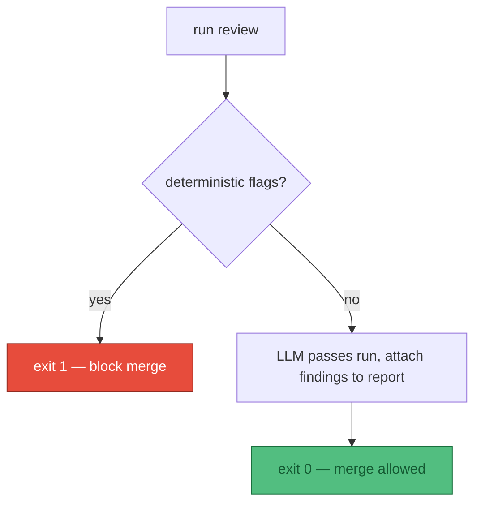

# Exit codes & CI contract

The whole point of pulling this out of a skill and into a command-line interface (CLI) is that
**continuous integration (CI) can gate on it.** That requires a stable exit-code contract — a
number the CI runner can branch on without parsing prose.

:::info Parked — L4 detail
This is an **L4** decision (how the built tool behaves), deliberately out of scope for the
[design](/concept/approach). It presupposes choices we have not made yet — is this even a CLI, does
it run in CI or by hand? It is recorded here so the thinking is not lost, not because it is settled.
:::

## Exit codes

| Code | Meaning | CI behaviour |
|---|---|---|
| `0` | Clean — no flags from any pass that ran | Merge allowed |
| `1` | Flags found — at least one deterministic check failed | **Block the merge** |
| `2` | Usage / configuration error (bad flag, missing built output) | Fail the job, fix the invocation |
| `3` | Internal / tool error (lychee crashed, browser wouldn't launch) | Fail the job, investigate the tool |

The split between `1` and `3` matters: `1` means *the docs are wrong*, `3` means *the reviewer is
wrong*. CI should treat them differently — `1` is a content author's problem, `3` is a maintainer's.

## What gates, and what doesn't

Only the **deterministic** passes contribute to exit code `1`. The LLM passes (visual judgment,
soft-404 tier-3) produce findings but **do not** fail CI on their own, because they're
non-deterministic, and hard-gating on a stochastic verdict is a mistake. They surface as report
output a human reviews.

## Output modes

- **Human (default):** a findings table grouped by pass.
- **`--json`:** machine-readable findings for the CI runner or downstream tooling.

> CLI = Command-Line Interface.
