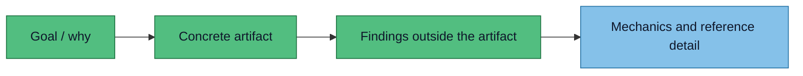

# Lessons learned

The useful pattern is:



:::tip Core rule
Show the thing. Show what is wrong with it. Then explain the system.
:::

The first drafts were not wrong. They were correctly structured in the wrong order: categories,
engines, metrics, and CI contracts before the reader had seen the failure the tool exists to
prevent. The examples below are the real edits, with the actual text before and after.

## Concrete examples

### Entry page led with the taxonomy

**Asked:** turn the README into a formal spec.

**LLM did:** opened with the problem-in-the-abstract, then a four-dimension table, before the reader
saw anything concrete.

**Better:** open with one plain sentence, then drop the reader straight onto the broken page.

```md
Before:
**The problem.** A docs site can build cleanly and still be broken — a diagram that renders as raw
code, a link that 404s, a page that's an unreadable grey wall, a claim that contradicts another
page. The build is green. Nobody notices until a reader does.

After:
A green docs build only proves the files compiled. It does not prove the page a reader sees is
usable.

<AnnotatedDocPage />
```

:::tip Takeaway
A spec is easier to understand after the reader has seen the failure it is trying to prevent.
:::

### What/Why became visible scaffolding

**Asked:** make the spec clearer about what we are doing and why.

**LLM did:** added bold `What this does` / `Why it's cheap` labels on every paragraph.

**Better:** use those labels while drafting, then rewrite into normal prose.

```md
Before:
**What this does.** It reviews the *rendered* site — what a visitor actually sees — across four
dimensions, so a green build means the docs are genuinely good, not just compilable.

**Why it's cheap.** Most defects are *verifiable*: a link resolves or it doesn't.

After:
The reviewer checks the rendered site, not just the Markdown source. Most defects are verifiable —
a link resolves or it does not — so a model is spent only where judgment is unavoidable.
```

:::tip Takeaway
`What / Why` is a planning tool. It is not automatically good published copy.
:::

### Tool framing became the front door

**Asked:** replace the vague "what it catches" framing.

**LLM did:** kept tool-centric category language — `Links / Rendering / Content / Consistency` — as
the first thing the reader meets, and made it the nav label too.

**Better:** name the page and the categories after the reader's problem, not the implementation.

```md
Before:
title: What it catches
| **🔗 Links** | **🖼️ Rendering** | **✍️ Content** | **🧭 Consistency** |

After:
title: Reader failures
Broken link · Raw diagram · Unexplained acronym · Screenshot mismatch
```

:::tip Takeaway
The first page should explain the reader problem, not teach the implementation taxonomy.

Crucually - lead with a diagram of WHY we are doing this project? whats the point? a diagram says 1000x words
:::

### Errors were drawn inside the artifact

**Asked:** show broken links, bad rendering, unclear content, and mismatch visually.

**LLM did:** put error labels in the margins of the fake page, so the evidence and the verdict
fought for the same space.

**Better:** keep the page or screenshot clean, then list findings below it as a review report.

```md
Before:
[fake docs page with error labels in every margin]

After:
[clean fake docs page]

Findings:
- dead setup link
- raw Mermaid block
- unexplained acronym
- screenshot/date mismatch
```

:::tip Takeaway
The artifact is evidence. Do not cover the evidence with the review.

The errornous screenshot of a docs page with bad links/malford diagrams showing all the "wrong" things says 1000x words! demonstrates clearly to the user...

Then below we explain what was wrong - this is 1000x better than a wall of text explaining what we are trying to achieve
:::

### "Consistency" stayed abstract

**Asked:** make document "consistency" mean something concrete.

**LLM did:** described it as a coherence property.

**Better:** show one specific contradiction the reader can see.

```md
Before:
| **🧭 Consistency** | Does it cohere with the rest of the document and its own standards? |

After:
User request: "Find me Skyscanner flights from London to Tokyo in June 2026."

Visible result: London → Tokyo · 12 July 2026 · Skyscanner

The reviewer should flag the contradiction between the text and the rendered evidence.
```

:::tip Takeaway
Abstract categories only land when they are tied to a visible contradiction.


Once again - diagram illustration says 1000x words!
:::

### Test corpus opened with abstractions

**Asked:** explain the test corpus.

**LLM did:** opened with two abstractions stacked on each other — "corpus of pages" and
"expectations file" — before the reader had seen a single case.

**Better:** walk through one tiny case first, then name the machinery.

```md
Before:
The reviewer is specified by a corpus of pages with known, deliberately planted defects plus an
expectations file that says what each defect is and whether the reviewer should flag it.

After:
broken-links.mdx links to /setup. No /setup page exists.
Expected result: report a broken internal link. If the reviewer misses it, the test fails.
```

:::tip Takeaway
Name the abstraction after the reader has seen one example.
:::

### Metric jargon hid a simple idea

**Asked:** explain why every failure category appears twice in the corpus.

**LLM did:** reached for `recall` and `precision` to carry the whole explanation.

**Better:** say it in the reader's words — problems to catch, look-alikes to ignore.

```md
Before:
### 1. Two-sided — recall and precision
- MUST CATCH — a genuine defect. If the reviewer misses it, recall has dropped.
- MUST NOT CATCH — a look-alike that's actually fine. If the reviewer flags it, precision has
  dropped.

After:
Each problem type needs two examples: one the reviewer must flag, and one it must leave alone.

Real problems  — a link to a missing page, a Mermaid block shown as raw text, an unexplained
acronym. If the reviewer misses one, the test fails.

Look-alikes to ignore  — example.com inside a shell snippet, an acronym already in a glossary, an
intentional 404. If the reviewer flags one, the test also fails.
```

:::tip Takeaway
A metric name is not an explanation. If a term needs its own glossary entry to be read, the idea
underneath it can usually be said plainly.
:::

### Borrowed jargon taxed the reader

**Asked:** describe which checks block and which only report.

**LLM did:** leaned on terms the project has not committed to — `CI` (when we do not yet know if this
runs in a pipeline or by hand), `modality`, and a `recorded golden` verdict.

**Better:** describe the behaviour in plain words and keep machine terms out of the reader path.

```md
Before:
### 2. Two-tier — hard CI gate vs. soft LLM check
FAIL CI — recall or precision regressed
the verdict matches a recorded golden

After:
## What can fail a run
failed run — missed defect or false alarm
Same kind of finding, or close to a saved example verdict
```

:::tip Takeaway
Every acronym or borrowed term is a tax on the reader. Pay it only when the project has actually
committed to the thing the term names.

Think what do readers understand - there is SO MUCH logic packed into the *before* - *after* reads more cleanly
:::

## Rules to add to the documentation skill

- Start concept/spec pages with the **goal** and a **concrete artifact**.
- Keep labels and findings **outside** screenshots, fake pages, cards, and diagrams.
- Put category tables, architecture, tools, and test layouts **after** the example.
- If introducing machinery, show one tiny worked example before naming the machinery.
- Treat `What / Why` as drafting notes, not required published headings.
- Do not spend a metric name (`recall`, `precision`) where a plain sentence works.
- Do not borrow a term the project has not committed to (`CI`, `modality`, `golden`) just to sound precise.

## Reusable prompt

```text
Write this as a reader-first spec page.

Start with the goal. Then show one concrete artifact the reader can inspect.
List the findings outside the artifact. Only after that, explain categories,
tools, architecture, or tests.

If you introduce an abstract mechanism, first show one tiny worked example.
Do not use a metric name or a borrowed acronym where a plain sentence works.
```

## Skim test

A good page should pass this:

- **10 seconds:** the reader can say what problem the page is about.
- **A little longer:** the reader can point to a concrete example.
- **By the end:** the reader can explain what happens next.

If a page only teaches category names, it is reference material, not the front door.
