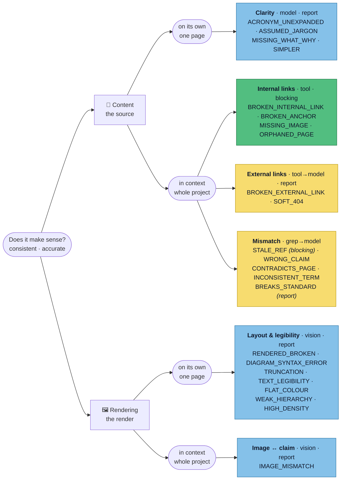
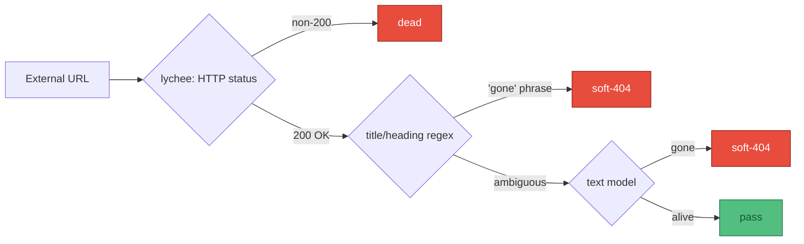

# Approach

The [spec](/spec/reference) says *what* to catch. This is *how*: one question, cut two ways, each cell
sent to the cheapest engine that can answer it. Code — exit codes, output, CI — is
[deferred](/appendix/exit-codes).

**🟩 tool** — provable, blocking &nbsp;·&nbsp; **🟦 model** — judgment, reported &nbsp;·&nbsp;
**🟨 tool→model** — tool filters, model judges the survivors.

- **Content vs rendering** — the source an author wrote vs the page a visitor sees. A page can have
  perfect source and still render wrong, so they take different eyes.
- **On its own vs in context** — visible in one page, vs only real against the rest (link graph,
  sibling pages, code). This sets what a pass loads: one page, or the whole project.

Mismatch is the one straddle: mostly content-in-context, but its `IMAGE_MISMATCH` sits in the
rendering cell — the axes follow the *evidence*, and that bucket draws from both.

## When a model is needed, the modality is forced

Not a free choice — picking wrong is the most expensive mistake here.

| Question | Modality | Why the other is wrong |
|---|---|---|
| Is this external link dead? | **Text** | The "gone" signal is in the title/heading. Rendering a 404 to pixels is slower and dearer for no gain. |
| Does this page render well? | **Pixels** | Layout, contrast, a broken diagram — none survive a Markdown round-trip. Scraping back to text discards the layer under review. |
| Does the evidence match the claim? | **Either** | Text for claims and code refs; vision when the evidence is a screenshot or rendered state. |

This is why scrape-to-Markdown tools (Crawl4AI, Firecrawl) are wrong for *visual* review: they discard
the visuals that are the whole point of looking.

## Two design details behind the cells

**External links escalate cheapest-first** — spend the model only on ambiguous survivors:

**Rendering drives a real browser** — headful Playwright scrolls, clicks and expands so lazy and
interactive elements actually exist, then captures **per-viewport** (not one giant image) so each shot
is an aspect ratio the vision model reads well.

:::warning Open decision — absolute vs. regression
Score layout cold (**absolute**, no baselines, noisier) or flag only what changed against a known-good
render (**regression**, cleaner but needs baseline management)? **Leaning absolute first** while the
site is mid-migration, adding a snapshot gate once it stabilises.
:::

:::tip Design by cell, run by pass
The grid is the unit of *design*, not execution. At runtime the cells collapse into a few passes — one
lychee run, one shared browser session, one text-model pass over the remainder — because that is
cheapest.
:::
