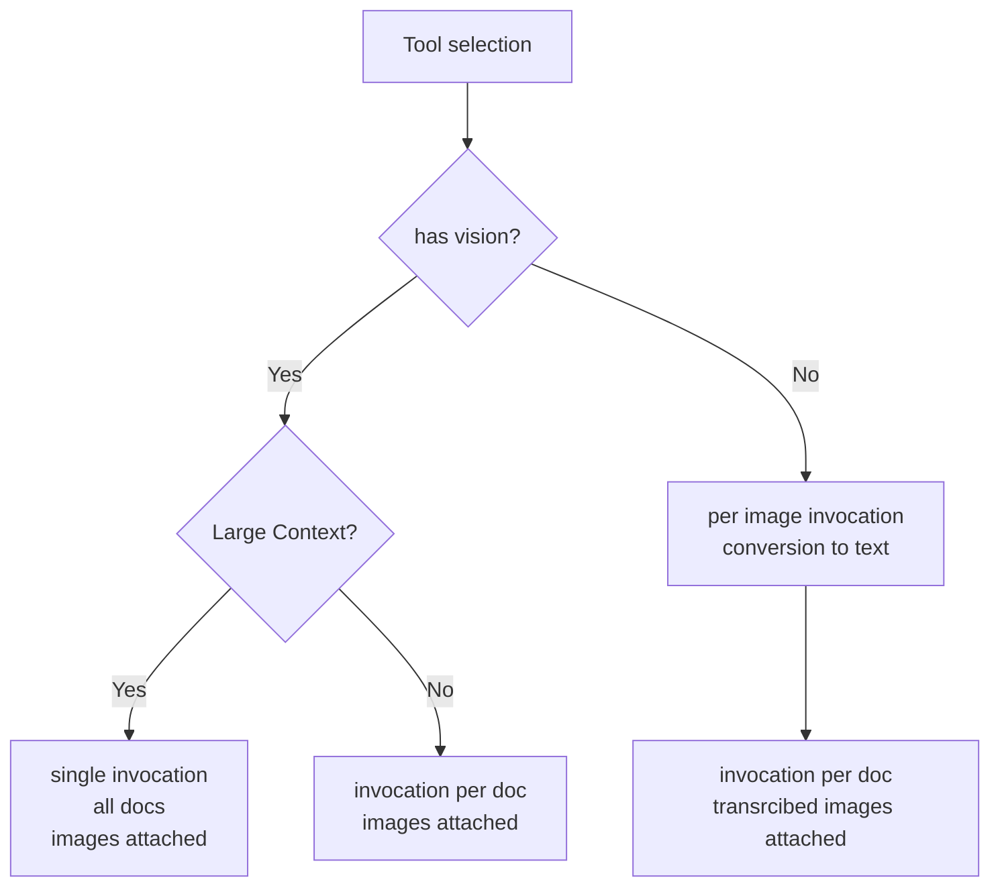
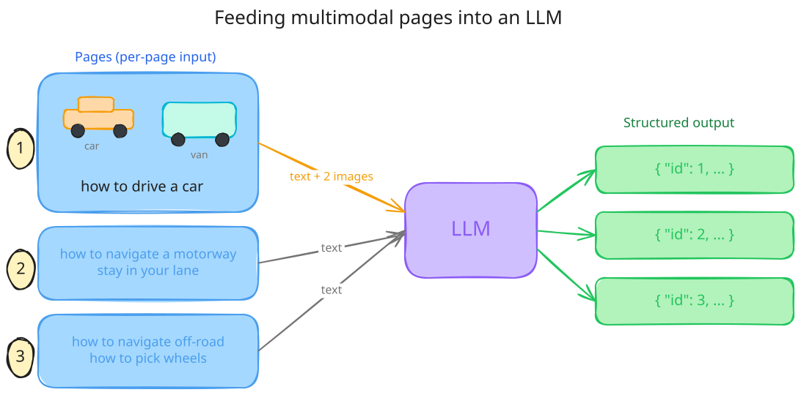
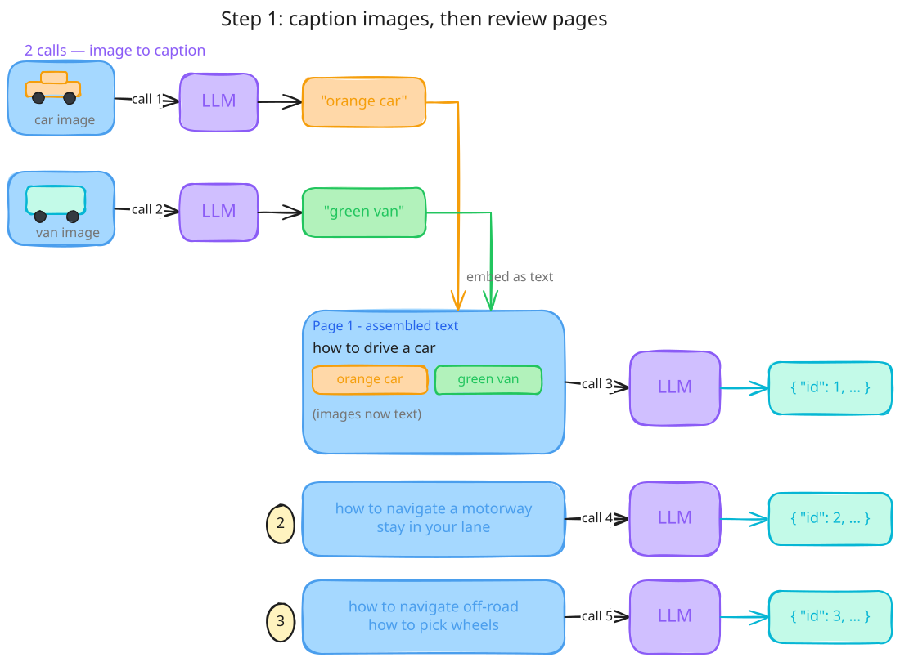

# Approach
## Model Selection

The [spec](/spec/reference) says *what* to catch. This is *how*

Firstly, the invocation on the tool depends on the model used to detect failures

### Single invocation

If you're fine burning through frontier model (gemini/claude) credits, the entire content and images can be passed into the model

This is by far the simplest approach, but requires a vision + text model and a large context window (large enough to process all data in one go)

### Multiple invocation

For local models, a dependency tree is built such that each document can be processed individially, thus enabling smaller models to be able to process large documentation sets. For models lacking vision, a separate model is needed to convert the image to text for the model to judge failures as an additional step

Thus the process becomes 

## Workflow

