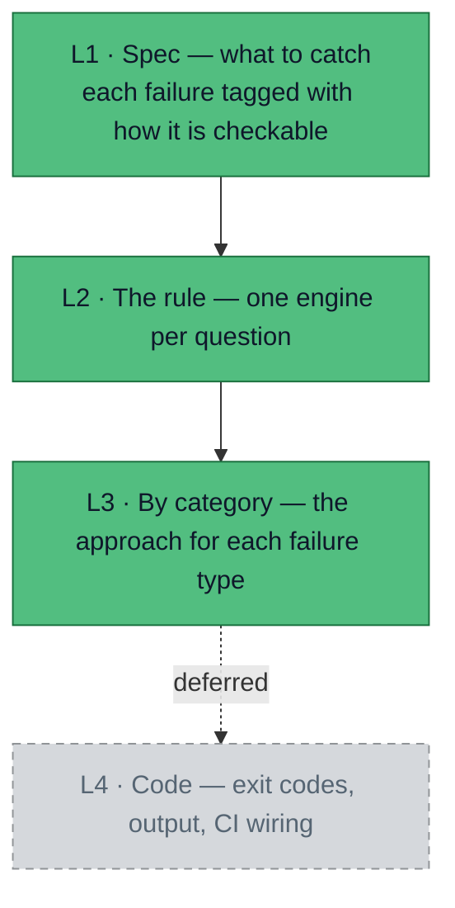
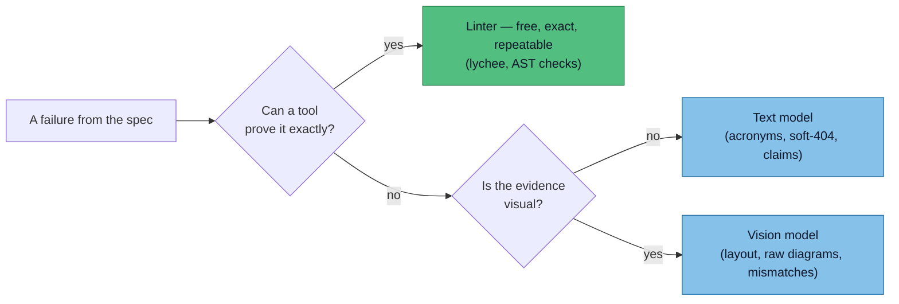
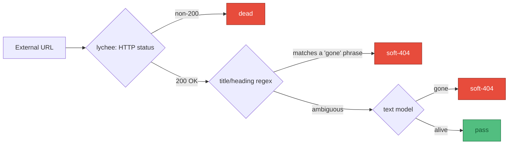

# Approach

The [spec](/spec/reference) says *what* to catch and, for each failure, *how* it can be proven.
Design is the next step down: *how* we actually catch it. It stops short of code.

Design covers the green levels. **L4 — the code, the exit-code contract, output formats — is
deliberately out of scope here.** Those are decisions for when the tool is built; they are parked in
the [appendix](/appendix/exit-codes).

## L2 · One engine per question

The whole approach is one move: **send each question to the cheapest engine that can answer it
reliably.** A model is never asked something a tool can prove for free.

This is just the [checkability rule](/spec/reference) the spec records per category, read as an
instruction. Two rules govern how it is applied.

**Text or pixels is not a free choice.** When a question does need a model, the modality is forced
by where the evidence lives. Picking the wrong one is the most expensive mistake available here.

| Question | Right modality | Why the other is wrong |
|---|---|---|
| Is this external link dead? | **Text** | The "gone" signal is in the page's title/heading. Rendering a 404 to pixels for a vision model is slower and dearer for no gain. |
| Does this page render well? | **Pixels** | Layout, contrast, overlap, a broken diagram — none survive a Markdown round-trip. Scraping the page back to text throws away the exact layer under review. |
| Does the evidence match the claim? | **Either** | Text compares page claims and code references; vision is needed when the evidence is a screenshot, chart, or rendered state. |

:::info Why this matters
Tools like Crawl4AI and Firecrawl scrape a rendered page back into clean Markdown for a text model.
Excellent for extracting content — wrong for a *visual* review, because they discard the visuals
that are the whole point of looking.
:::

**Escalate cheapest-first.** Inside a single question, run the cheap deterministic tier first and
only spend the expensive engine on what survives. The external-link check below is the clearest case.

## L3 · The approach, category by category

The spec sorts every failure into four categories. Design meets each one the same way — deterministic
where it can, a model only on the remainder — but the details differ. Subcategory codes (`LIKE_THIS`)
are called out only where they change the approach; the full list is in the
[category reference](/spec/reference).

### Links — does every link resolve?

**Internal** (`BROKEN_INTERNAL_LINK`, `BROKEN_ANCHOR`, `MISSING_IMAGE`, `ORPHANED_PAGE`): mechanical,
**blocking**. [lychee](https://github.com/lycheeverse/lychee) runs against the built site — a route,
anchor, or image resolves or it does not. Zero ambiguity, no model.

**External** (`BROKEN_EXTERNAL_LINK`, `SOFT_404`): the only genuinely uncertain bucket, since we do
not control those servers. Escalate cheapest-first and only reach for a model on the ambiguous
survivors. This is a **text** question — the "gone" signal lives in the title and heading.

### Rendering — does it look right on screen?

All screenshot review, all **reported** rather than blocking — judgment, not proof. This is the pass
the project exists for: a page can compile and still render wrong.

- **Headful Playwright drives the real page** — scroll, click, expand — and screenshots each state. A
  real visible browser is the only reliable way to confirm a component rendered rather than merely
  compiled; lazy-loaded and interactive elements do not exist until something drives them.
- **Segmented capture** beats one giant full-page image: scroll by viewport height and capture each
  frame, so every screenshot is a normal aspect ratio the vision model reads well.

:::warning Open decision — absolute vs. regression
Score a page's layout cold (**absolute**) or flag only what changed against a known-good render
(**regression**)? Absolute is simpler to start — no baselines — but noisier. Regression needs
baseline management but gives a far cleaner signal. **Leaning absolute first**, since no baselines
exist mid-migration, then adding a snapshot gate once the site stabilises.
:::

### Clarity — can a newcomer follow it?

Text review, **reported**. The deterministic tier does the *finding* and the model does the
*judging*: AST parsing extracts the candidates — acronyms, first-use positions, code references —
and the text model decides which are actually unexplained or assume too much
(`ACRONYM_UNEXPANDED`, `ASSUMED_JARGON`, `MISSING_WHAT_WHY`, `SIMPLER`).

### Mismatch — does it contradict itself or the evidence?

This category splits by where the evidence lives:

- `STALE_REF` — **mechanical, blocking.** Grep the repo for the named symbol; if `process_frame()`
  is documented but absent from the code, that is provable.
- `WRONG_CLAIM`, `CONTRADICTS_PAGE`, `INCONSISTENT_TERM`, `BREAKS_STANDARD` — **text model,
  reported.** Comparing claims across pages and against stated standards needs judgment.
- `IMAGE_MISMATCH` — **vision, reported.** The booking card showing 12 July 2026 for a June request
  only exists in pixels.

:::tip How these run
The four categories collapse into a few **passes** at runtime — one lychee run, one browser session
shared by the visual checks, one text-model pass over the remainder — because that is the cheapest
way to execute them. But the unit of *design* is the category, not the pass.
:::
