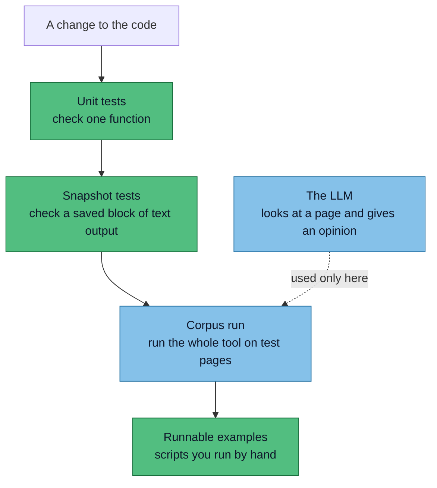
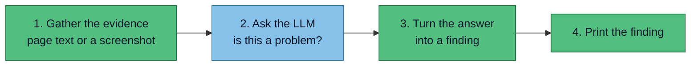
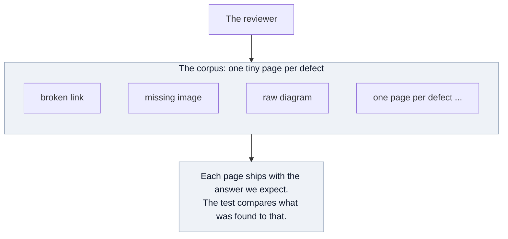
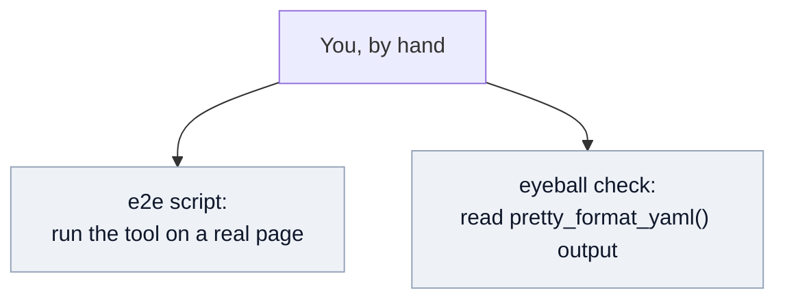

# ADR 0001: Test and corpus strategy

Status: Accepted (2026-06-29)

This Architecture Decision Record (ADR) is about the **reviewer**: the tool this project builds, which checks a rendered documentation site for the defects a green build misses, like dead links, broken diagrams, unclear prose, and claims that contradict the page. For what it catches and why, see [the problem](/problem/reader-failures) and the [approach](/concept/approach). This record decides how we test that reviewer, and how its example **corpus** (a set of small test pages with known, planted defects) is built.

## The problem we are designing against

The reviewer mixes two kinds of check. Some have a provable answer (a link resolves or it does not). Others need judgment, and for those we call an LLM: the AI that looks at a rendered page, or reads the prose, and gives an opinion ("this diagram looks broken", "this acronym is never explained").

The risk is that the LLM leaks into every function until nobody can trace what it does, and the tests start depending on a live call that answers differently every run.

:::danger The failure mode
Going from spec straight to code ends in a pile of LLM calls that answer differently every run, that you cannot test, and that you stop understanding by week two. Everything below exists to stop that one outcome.
:::

## The shape of the test suite

Four kinds of test, run in order. Only one of them ever calls the LLM.



Three of the four (green) never call the LLM. Only the corpus run does, and even there an LLM finding cannot fail the build. That is the whole safety argument in one picture.

## The four layers, shown not named

A unit test pins one function with literal values written in the test file. A fixture is a whole input page plus the result we already know it should produce, run through the entire tool. Here is each layer as real code.

### Unit test: one function, exact

```python
def test_parse_verdict_flags_unexplained_acronym():
    raw = '{"unexplained": true, "term": "GDS"}'
    assert parse_verdict(raw) == Finding("ACRONYM_UNEXPANDED", term="GDS")
```

Literal in, literal out, no LLM. This is the bulk of the suite. (A `Finding` is one reported defect: its category and where on the page it sits.)

### Snapshot: save the text output, diff it later

Some functions return text that is annoying to type out by hand but always the same for the same input. The report formatter is the example. Instead of writing the expected output into the test, you run the function once, look at what it produced, and if it reads right you save it to a file. After that the test just checks the output still matches that file. When you change the formatter on purpose, you read the diff and re-save.

```python
def test_report_format(snapshot):
    findings = [Finding("BROKEN_INTERNAL_LINK", location="trip.mdx:7")]
    assert format_report(findings) == snapshot   # pytest --snapshot-update to re-bless
```

:::tip This is not the visual review
Snapshot here means saving a function's text output to a file. It has nothing to do with screenshots or the LLM looking at a page. The visual review uses a separate screenshot baseline, a different thing with a confusingly similar name. See the absolute vs regression note in [approach](/concept/approach).
:::

### Corpus run: the whole reviewer against a fixture

The plain version: we know this page should produce a broken link, so the test runs the reviewer on it and checks that it says so. One tiny page that plants a single defect, with the result we expect written into its own frontmatter, so the page and its answer cannot drift apart.

```md
---
title: Booking guide
expect:
  - category: BROKEN_INTERNAL_LINK
    where: "the 'setup guide' link"
    result: blocking
note: "Links to /setup, which has no page in this corpus."
---

# Booking guide

Before you start, read the [setup guide](/setup) to configure your account.
```

Provable checks must match what we expect. LLM checks are compared softly, by category rather than exact wording, and never gate the build.

:::tip Keep the matching simple for now
A fixture passes if the finding we expect shows up. We do not yet fail a page for missing a second defect or for reporting an extra one. If a page has two blockers and the reviewer catches one, that is fine for now; assume a later pass tightens it. Get the slice working first, harden the matching afterwards.
:::

### Runnable examples: entry points, not assertions

Two uses, and neither is a normal pass/fail test.

The first is an end-to-end script: run the whole reviewer on one real page to watch it work, the way `scripts/e2e-docs.sh` already does. Useful when a function gets complicated and you want to see real behaviour, not a green dot.

The second is for functions with no single correct output, like a `pretty_format_yaml()` that just has to look reasonable. You cannot assert that, so you run it and read the result yourself.

Both double as smoke tests. The suite runs them so a crash shows up, even though it does not check their exact output. They are the bridge between the docs and the tests: something you run to understand the tool, that also fails loudly if it breaks.

| Layer | The example above | Calls the LLM? | Gates the build? |
|---|---|---|---|
| Unit | `parse_verdict` assertion | no | yes |
| Snapshot | `format_report` saved output | no | yes |
| Corpus | `broken-internal.mdx` + `.expect.json` | only here | provable yes, LLM no |
| Runnable example | `e2e-docs.sh`, `pretty_format_yaml()` | no | runs without error |

## Why this kills the maintenance fear

A pass that uses the LLM is just a four-step pipeline, and only one step is the LLM. The other three are ordinary code you can read and test.



Only step 2 (blue) is the LLM. Steps 1, 3, and 4 are plain code.

:::tip No mountain
Your LLM code is two readable things: the prompt you send and the parser that reads the reply. The call between them is a single step. There is nothing to get lost in, because the LLM never spreads past it. To debug it you open the saved reply and the parser, not a sprawl.
:::

## The corpus has two roles, do not confuse them

The [worked example](/spec/worked-example) is busy on purpose. It packs many defects into one realistic page so a person can see what the tool is for. The real corpus is the opposite: many small pages, one defect each, so a miss points at one cause.



The runnable examples sit apart from all of that. They are not graded. They are how a person drives the tool and checks the functions that have no single right answer.



:::info Single source of truth
The fixtures and their expectation files live in the test tree. If the docs show the corpus, that page is generated from the fixtures, never hand-copied. Two hand-kept copies drift, and a doc that no longer matches the code is the exact failure this tool exists to catch.
:::

## Consequences

Most of the codebase is testable with no LLM in the loop, so daily work does not hang on a flaky call. A misbehaving LLM means reading one prompt and one parser, both pinned by a saved reply, not hunting through tangled code.

The costs are real. Saved replies need refreshing when prompts change. Soft category checks can miss a subtle regression a human would catch. Generating the corpus view for the docs needs a little tooling rather than hand editing.

It rules out the tempting shortcut: one big LLM pass that judges a whole page at once. Quick to write, almost impossible to test or maintain, which is the outcome this ADR prevents.

## Open question

:::warning Still undecided: finding granularity
Must the reviewer name each subcategory (truncation as distinct from illegible text), or is a coarse verdict (this page renders badly) enough? Named means one fixture per code and more of them. The [category reference](/spec/reference) lists them separately today, which points toward named. This sets how many fixtures the first slice needs, so it is the next thing to settle.
:::
