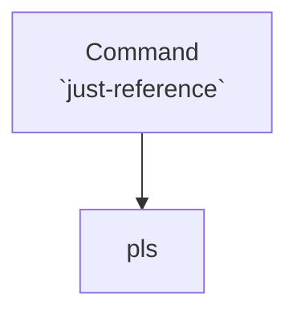

# Category reference

The failure taxonomy behind [Reader failures](/problem/reader-failures): every kind of defect the
reviewer can report

> Failure taxonomy is very 🤖 - ELI5 is more like "how do we classify" this. E.g. alarm broken taxonomy, just classifying it into "failure mode": "loss of function", "detection method": "user observed" etc

Categories are simply a fixed name for a type of error flagged by the review of a document.

We also *use deterministic checks* (`Mechanical`) where we can - as its more reliable that using an LLM model - e.g. for internal broken links with markdown

This leads to a fundamental categorisation of problems:
- `Mechanical`, from deterministic scripts (e.g. "does this file exist,  yes or no => pass/fail")
- `Cognitive`, from a human/model (e.g. "does this chart look rendered properly => pass/fail")

## The full list

Every category, its example, and how it is checked lives on one page — the
**[category table](/spec/categories)**.

That page is generated straight from `internal/finding.Catalog` in the Go source, so it can never
drift from the code. This page is the human explanation; that page is the machine-readable list.

## Generation

The list is generated as follows:

## Appendix
Claude 🤖 initially added categories for broken links - but this is out the scope of this project, plenty of tools do this (and do it better) than I can.

Also, they *should* be caught by the builder used for the documentation. The option to set to catch broken links for the most common documentation builders are shown below

mkdocs configuration is [here](https://www.mkdocs.org/user-guide/configuration/) - it has no anchors to specific configuration options

- for rspress, the `checkDeadLinks` option [here](https://rspress.rs/guide/use-mdx/link#dead-links-checking) 
- for rspress, the `checkAnchors` option [here](https://rspress.rs/api/config/config-build#markdownlinkcheckanchors)
- for mkdocs, `validation => links => not_found` for broken refs
- for mkdocs, `validation => links => anchors` for broken anchors
- for mkdocs, `validation => nav => validation.nav.omitted_files` for missing files

| Category | Example | How checked |
|---------|---------|---------|
| `BROKEN_INTERNAL_LINK` | link points to `/setup`, but no `/setup` page exists | Mechanical |
| `BROKEN_ANCHOR` | `guide#instal` but the page has `#install` | Mechanical |
| `MISSING_IMAGE` | `` but the image is missing | Mechanical |
| `BROKEN_EXTERNAL_LINK` | external page returns 404 | Mechanical |
| `ORPHANED_PAGE` | page exists but no nav/page links to it | Mechanical |

## Future work
Possible future work is implementation a system of hard blocks on link failures vs soft blocks for review ("this might be broken im not sure") - thus every categorisation is treated as a "failure"
