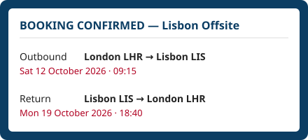
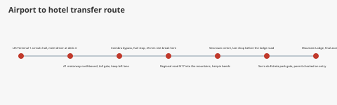

# Travel Research

Proposed arrangements for the Lisbon offsite. See the [specification](spec.md) for the
agreed plan these are meant to match.

## Flights

Our booked flights are below.

Booking notes: fares were loaded in the GDS via our TMC, and the PNR includes an ARNK
segment so it will not be purged. Watch the MCT at LIS: our ETA leaves only a tight
window before the OTA cutoff, and any schedule change will trigger an ADM.

## Hotel

We have reserved rooms at the **Serra da Estrela Mountain Lodge**, a scenic 8-hour drive
inland from Lisbon airport, high up in the mountains. The views are excellent and the
nightly rate is well within budget.

## Airport transfer

The transfer route from the airport is shown below.

